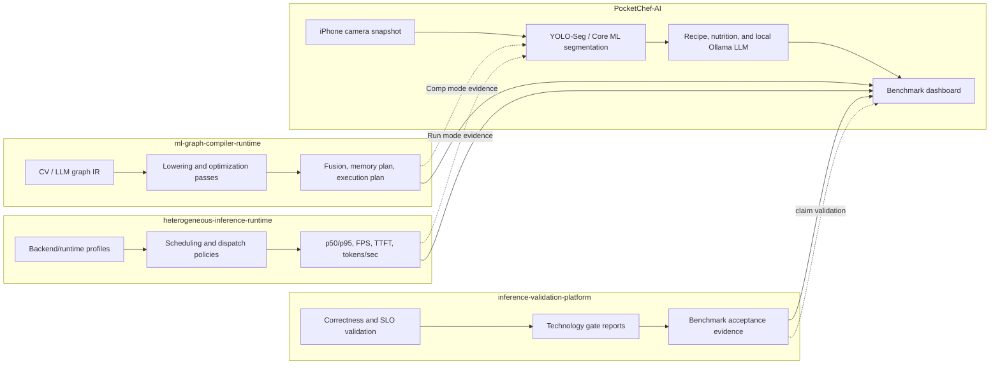

# PocketChef-AI

PocketChef-AI is a native iOS food segmentation app and mobile ML compiler/runtime value demo.

The first screen is the camera. The current debug build captures an iPhone frame, runs YOLO-Seg/Core ML segmentation, draws a filled target mask, reports FPS, p50/p95 latency, active model, and optimization mode, then turns the selected visual target into a local recipe/nutrition snapshot.

## Recent Updates

- Added a portfolio artifact provider layer for compiler, runtime, validation,
  and target-device profile artifacts.
- Imported frontend-normalized Qwen runtime trace and iPhone 15 compiler
  serving-plan artifacts for app-side inspection.
- Added runtime trace playback engine/card UI so the app can display
  artifact-backed runtime decisions without claiming live iPhone graph
  compilation.
- Added device profile export for compiler-repo target-profile input.
- Added Core ML load diagnostics and a Core ML device benchmark section in the
  result sheet.

Truth boundary: PocketChef imports compiler/runtime artifacts on the app side
and runs the Core ML/Vision segmentation path. It does not live-compile the
YOLO-Seg graph on iPhone, and the Mac-side compiler/runtime artifacts should
not be described as live iPhone Metal dispatch evidence.

## Edge AI Systems Map

PocketChef-AI is the mobile Edge AI demo shell that connects three systems repos into one visible iPhone experience:



| Repo | Role in PocketChef-AI | Input | Decision | Metric / evidence |
|---|---|---|---|---|
| PocketChef-AI | Edge AI app and demo shell | iPhone snapshot, selected food target, typed LLM question | Core ML mode, segmentation postprocess, prompt lowering, local Ollama path | FPS, p50/p95, TTFT, total latency, tokens/sec |
| ml-graph-compiler-runtime | Compiler evidence provider | CV/LLM graph abstraction | lowering passes, fusion, memory planning, backend placement, execution plan | lowered graph, fusion report, memory savings, cost plan |
| heterogeneous-inference-runtime | Runtime evidence provider | CV and LLM-shaped workloads | backend policy, scheduling, dispatch, KV/cache serving policy | runtime latency, throughput, p95, FPS, serving metrics |
| inference-validation-platform | Optional validation layer | runtime/compiler artifacts and benchmark outputs | correctness/SLO/technology gate validation | pass/fail reports and accepted benchmark evidence |

In short:

```text
PocketChef-AI = iPhone Edge AI demo
ml-graph-compiler-runtime = compiler decisions behind Comp
heterogeneous-inference-runtime = runtime decisions behind Run
inference-validation-platform = validation evidence for claims
```

Every technical claim in the main plan must answer three questions:

```text
Input source?
-> compiler/runtime decision?
-> execution or serving metric impact?
```

The core systems story is:

```text
iPhone Camera
-> YOLO-Seg/Core ML segmentation
-> Runtime evidence from heterogeneous-inference-runtime
-> Compiler evidence from ml-graph-compiler-runtime
-> Artifact-gated benchmark dashboard
```

## Memory Evidence Map

PocketChef treats memory as a first-class compiler/runtime metric. The app now records real device memory events, while README headline claims remain gated by artifacts.

| Area | Evidence type | Input | Decision | Memory metric |
|---|---|---|---|---|
| Compiler Memory | artifact-backed estimate | YOLO-Seg graph abstraction | `MemoryPlanningPass` + tensor lifetime reuse | activation peak estimate `19.529 MB -> 14.798 MB` |
| Runtime Memory | instrumented, real iPhone export pending | same iPhone snapshot + same model | Core ML compute units, camera/session/cache policy | `physical_footprint_mb`, RSS, event deltas |
| Compression Memory | artifact-backed file size | FP32 / INT8 / pruned Core ML artifacts | Zip mode model choice | model size now; loaded memory pending iPhone export |
| LLM Serving Memory | artifact-backed runtime profile | local LLM request stream + serving workload artifacts | KV cache allocation + memory-pressure scheduling | peak KV `868.75 MB`, peak memory `1636.75 MB`, OOM `0` |

Current compiler memory evidence:

```text
Naive activation memory:    19.529 MB
Planned peak activation:    14.798 MB
Saved activation memory:     4.731 MB
```

Current runtime memory truth boundary:

```text
Implemented: iPhone in-app memory sampler and event report copy flow.
Pending: real iPhone `runtime_artifacts/iphone_memory_report.json` export with measured peak memory.
```

Memory artifacts:

```text
compiler_artifacts/generated/cv_memory_timeline.json
compiler_artifacts/generated/cv_memory_summary.md
runtime_artifacts/iphone_memory_report.json
compression_artifacts/model_size_report.json
benchmark_reports/memory_evidence_summary.json
```

Crash diagnosis events recorded by the app:

```text
app_start -> live_preview_steady -> before_capture -> after_copy_pixel_buffer
-> after_make_uiimage -> after_stop_session -> before_model_load -> after_model_load
-> before_inference -> before_mask_decode -> after_inference -> after_mask_decode
-> after_set_detections -> before_retake_clear -> after_retake_clear
-> before_llm_ask -> after_llm_stream_finish -> after_llm_copy_json
```

## Compiler Pipeline Integration

PocketChef now has a Level 2.5 compiler integration:

```text
PocketChef script
-> ml-graph-compiler-runtime/build/run_cv_graph_demo
-> ShapeInference / Canonicalization / DTypePropagation
-> FusionCandidate / MemoryPlanning / BackendPlacement / Scheduling
-> LoweredGraph / ExecutionPlan / CostPlan artifacts
-> PocketChef dashboard + Comp mode summary
```

Run it:

```bash
python3 scripts/run_compiler_pipeline.py
python3 scripts/generate_core_evidence.py
```

Generated evidence:

```text
compiler_artifacts/generated/compiler_pipeline_manifest.json
compiler_artifacts/generated/compiler_pipeline_stdout.txt
compiler_artifacts/generated/cv_lowered_graph.json
compiler_artifacts/generated/cv_memory_plan.json
compiler_artifacts/generated/cv_execution_plan_v2.json
compiler_artifacts/generated/cv_static_schedule.json
compiler_artifacts/generated/cv_subgraph_partition.json
compiler_artifacts/generated/cv_cost_report.json
compiler_artifacts/generated/cv_cost_based_planner.json
compiler_artifacts/generated/mask_postprocess_lowering_report.json
compiler_artifacts/generated/metal_mask_spmd_benchmark_report.json
```

Truth boundary:

```text
Real: PocketChef invokes the external compiler repo on Mac and imports generated lowering/pass/optimization artifacts.
Not claimed: the iPhone app live-compiles the YOLO-Seg Core ML graph at runtime.
```

## SIMD Mask Postprocess Lowering

PocketChef V1 includes a live CPU scalar/SIMD mask postprocess lowering path for
YOLO-Seg mask decode. The input is the real app-side mask contract:

```text
YOLO-Seg mask coefficients + NCHW prototype tensor + crop box + threshold
  -> legality checks
  -> scalar CPU reference or SIMD CPU candidate
  -> runtime fallback reason and mask decode latency metadata
```

Run the evidence generator:

```bash
python3 scripts/generate_mask_postprocess_evidence.py
```

Generated evidence:

```text
compiler_artifacts/generated/mask_postprocess_lowering_report.json
```

Truth boundary:

```text
Real: live scalar/SIMD CPU mask postprocess dispatch exists in the PocketChef app.
Artifact-backed: synthetic YOLO-Seg-like benchmark report with p50/p95 latency,
fallback behavior, FPS-impact estimate, and correctness metrics.
Not claimed: Qualcomm Ripple, Snapdragon/QNN/Hexagon, live Metal dispatch, or
full compiler integration.
```

## Metal SPMD Mask Benchmark

PocketChef V2 adds a benchmark-backed Metal SPMD compute candidate for the same
YOLO-Seg mask decode contract. This keeps live app dispatch conservative while
still measuring the GPU lowering candidate against the scalar reference and SIMD
CPU path.

```text
YOLO-Seg mask coefficients + NCHW prototype tensor + crop box + threshold
  -> scalar CPU reference
  -> SIMD CPU candidate
  -> Metal one-thread-per-pixel SPMD candidate
  -> profile-selected backend with correctness evidence
```

Run the benchmark:

```bash
python3 scripts/generate_metal_mask_spmd_benchmark.py
```

Generated evidence:

```text
metal/mask_postprocess.metal
compiler_artifacts/generated/metal_mask_spmd_benchmark_report.json
```

Truth boundary:

```text
Real: the report compiles and runs a Metal compute kernel on the local Mac GPU,
then compares CPU scalar, CPU SIMD, and Metal SPMD candidates.
Artifact-backed: p50/p95 latency, FPS-impact estimate, profile rejection/selection,
and scalar-reference correctness metrics.
Not claimed: live iPhone Metal dispatch, Qualcomm Ripple, Snapdragon/QNN/Hexagon,
or production compiler-manifest integration.
```

## What This Repo Shows

PocketChef-AI is intentionally more than a recipe app. It is a portfolio-grade mobile AI optimization demo, but the headline plan only includes claims backed by the three-question rule.

| Variant | Input source | Decision | Metric impact | Evidence source |
|---|---|---|---|---|
| Base | iPhone snapshot + YOLO-Seg FP32 | default Vision/Core ML path | baseline p50/p95/FPS pending iPhone export | PocketChef-AI |
| Run | external CV runtime artifact, then PocketChef export when available | runtime backend policy | latency/FPS delta from runtime artifact | heterogeneous-inference-runtime |
| Comp | CV graph abstraction | fusion, memory reuse, backend placement | estimated latency/memory delta | ml-graph-compiler-runtime |
| Zip | YOLO-Seg compiled model family | quantization/pruning candidate choice | artifact size now; latency/stability pending real compression | PocketChef-AI |
| All | best measured model + runtime + compiler plan | combine only artifact-backed decisions | pending end-to-end measurement | PocketChef-AI |
| LLM | selected ingredient context + typed question | Ollama local streaming decode | TTFT / total latency / tokens/sec | PocketChef-AI |

`inference-validation-platform` remains optional validation evidence.
`mini-llm-serving-runtime-demo` remains the separate HTML workbench for
compiler/runtime/validation interviews; PocketChef-AI is the native iOS/mobile
ML front end for audiences that value SwiftUI, AVFoundation, Vision/Core ML,
and on-device app experience.

## Repo Layout

```text
PocketChef-AI/
├── ios/PocketChefAI/              # Native Swift iOS app
├── models/                        # Core ML packages generated by scripts
├── compiler_artifacts/             # CV graph, fusion, memory, cost artifacts
├── runtime_artifacts/              # Runtime benchmark and profiling artifacts
├── compression_artifacts/          # Quantization and pruning reports
├── llm_artifacts/                  # Local Ollama LLM serving benchmark schema/results
├── benchmark_reports/              # Combined reports for README/dashboard
├── scripts/                        # Export, benchmark, compression, report CLIs
└── dashboard/                      # Local benchmark dashboard
```

## iOS App

Open the app:

```bash
open ios/PocketChefAI/PocketChefAI.xcodeproj
```

Then in Xcode:

1. Select the `PocketChefAI` target.
2. Set your Apple Developer team under Signing & Capabilities.
3. Generate a `.mlpackage` model into `models/`. The Xcode project bundles that folder automatically.
4. Deploy to a real iPhone for camera and Core ML profiling.

The app supports these optimization modes, but App labels are not treated as proof by themselves:

- Baseline: default segmentation path.
- Runtime: runtime path whose headline numbers must come from `heterogeneous-inference-runtime` or real PocketChef iPhone export.
- Compiler: compiler path whose headline claims must come from `ml-graph-compiler-runtime` artifacts.
- Compression: model compression path for quantization and pruning candidates.
- Combined: runtime + compiler + compression enabled together.

Recipe, nutrition, and Visual Intelligence v1 are local UI features. The Snapshot Sheet also supports a free local LLM path through Ollama on your Mac, with TTFT, total latency, and tokens/sec displayed in the app.

Model artifacts kept in the app bundle:

```text
yolo_food_s_seg_fp32.mlmodelc
yolo_food_s_seg_int8.mlmodelc      # Zip quantization candidate placeholder
yolo_food_s_seg_pruned.mlmodelc    # Zip pruning candidate placeholder
```

Generated models in `models/` are copied into the app bundle as a folder resource, and the detector searches both the bundle root and `models/`.

Current detector status:

- The primary path is `YOLO-Seg Vision/Core ML`; the classifier is intentionally disabled while segmentation quality is being tuned.
- Base, Run, Comp, Zip, and All are wired to the intended systems paths:
  - Base: default segmentation baseline.
  - Run: runtime evidence path; numbers must come from runtime artifacts.
  - Comp: compiler evidence path; claims must come from compiler artifacts.
  - Zip: model-compression path for quantization and pruning candidates.
  - All: runtime + compiler + compression path together.
- The overlay draws a filled target segmentation mask, not a bounding-box-only demo.

### Visual Intelligence v1

The current app includes a local deterministic Visual Intelligence layer on top of the selected segmentation result:

```text
selected YOLO-Seg target
-> ingredient summary
-> recipe plan
-> nutrition estimate
-> missing item suggestions
-> local visual answer
```

Tap the bottom recipe card to open the snapshot sheet. The sheet shows:

- Scene summary: what the selected target looks like.
- Ask card: "What can I cook from this?"
- Nutrition estimate and diet tags.
- Helpful additions and shopping suggestions.
- Benchmark context, active mode policy, and local LLM serving metrics when Ollama is connected.

The deterministic planner remains the offline fallback. The real LLM path uses local Ollama and reports TTFT, total latency, prompt tokens, completion tokens, and tokens/sec.

### Free Local LLM Serving

PocketChef can ask a real local LLM without a paid API by calling Ollama on your Mac over LAN:

```text
selected YOLO-Seg target + nutrition context + typed user question
-> Ollama /api/chat streaming decode
-> TTFT, total latency, prompt tokens, output tokens, tokens/sec
```

Install and run Ollama:

```bash
brew install ollama
ollama pull qwen2.5:3b-instruct
ollama serve
```

Simulator can use:

```text
http://127.0.0.1:11434
```

Real iPhone must use the Mac LAN IP in the Snapshot Sheet Ollama settings:

```text
http://192.168.x.x:11434
```

If `qwen2.5:3b-instruct` is unavailable, the app falls back to `llama3.2:3b`. After each Ask LLM request, the app displays live serving metrics and can copy a single-run benchmark JSON. The dashboard reads the committed schema at:

```text
llm_artifacts/pocketchef_llm_benchmark_report.json
```

The Snapshot Sheet LLM panel has its own systems modes:

| LLM mode | Decision | Metric |
|---|---|---|
| Base | default Ollama streaming decode | TTFT / total latency / tokens/sec |
| Run | runtime keep-alive and shorter generation budget | TTFT and steady decode improvement |
| Comp | prompt lowering into compact structured context | prompt token reduction and latency |
| All | runtime keep-alive plus prompt lowering | end-to-end local serving latency |

### LLM Serving Evidence Bridge

PocketChef imports LLM serving evidence from the primary systems repos for the
native iOS app experience. It is separate from
`mini-llm-serving-runtime-demo`, which remains the HTML workbench for explaining
compiler/runtime/validation artifacts without Xcode or an iPhone.

```text
ml-graph-compiler-runtime/artifacts/apple_demo
-> serving graph IR, KV cache plan, scheduling plan, serving execution contract

heterogeneous-inference-runtime/results/llm_runtime_artifacts
-> prefill/decode benchmark, scheduler report, KV trace, serving framework report

PocketChef-AI/llm_artifacts/serving
-> artifact-backed LLM serving evidence for README/dashboard
```

Run:

```bash
python3 scripts/import_llm_serving_artifacts.py
```

Generated evidence:

```text
llm_artifacts/serving/llm_serving_evidence.json
llm_artifacts/serving/compiler/serving_execution_plan.json
llm_artifacts/serving/compiler/kv_cache_plan.json
llm_artifacts/serving/compiler/serving_framework_contract.json
llm_artifacts/serving/runtime/prefill_decode_benchmark.json
llm_artifacts/serving/runtime/scheduler_decision_report.json
llm_artifacts/serving/runtime/kv_cache_trace.json
llm_artifacts/serving/runtime/serving_framework_report.json
```

This answers the three-question rule for the LLM path:

| Stage | Input | Decision | Metric |
|---|---|---|---|
| App LLM | selected ingredient + typed question | Ollama local streaming decode | TTFT / total latency / tokens/sec |
| Compiler serving | tiny-gpt serving graph contract | prefill/decode split, KV plan, scheduling contract | KV memory and required serving metrics |
| Runtime serving | LLM-shaped request workload | cost-aware memory-pressure scheduler | p95 latency, tokens/sec, decode batch efficiency |
| Combined story | visual context + imported serving artifacts | prompt lowering + runtime keep-alive + serving policy evidence | app live metrics plus artifact-backed serving metrics |

Truth boundary:

```text
Real: PocketChef asks a real local Ollama model and measures live serving metrics.
Real: PocketChef imports compiler/runtime serving artifacts from the primary systems repos.
Not claimed: PocketChef directly runs vLLM, SGLang, Triton, TensorRT, or a live multi-request scheduler on iPhone.
```

## Model Export

Install dependencies in a Python environment that supports the packages:

```bash
python3 -m pip install ultralytics coremltools onnx onnxruntime numpy pillow
```

Export YOLO to ONNX and Core ML:

```bash
python3 scripts/export_yolo_to_coreml.py \
  --model yolov8n.pt \
  --output-dir models \
  --image-size 640
```

Export the current segmentation model:

```bash
python3 scripts/export_yolo_to_coreml.py \
  --model yolov8s-seg.pt \
  --output-dir models \
  --image-size 640 \
  --artifact-prefix yolo_food_s_seg
```

Export FastSAM segmentation models:

```bash
python3 - <<'PY'
from ultralytics import FastSAM
from pathlib import Path
import shutil

for source, prefix in [("FastSAM-s.pt", "fastsam_s_fp32"), ("FastSAM-x.pt", "fastsam_x_fp32")]:
    model = FastSAM(source)
    onnx = Path(model.export(format="onnx", imgsz=640, dynamic=False, simplify=True))
    Path("models", f"{prefix}.onnx").write_bytes(onnx.read_bytes())
    coreml = Path(model.export(format="coreml", imgsz=640, half=False, nms=False))
    out = Path("models", f"{prefix}{coreml.suffix}")
    if out.exists():
        shutil.rmtree(out) if out.is_dir() else out.unlink()
    shutil.copytree(coreml, out) if coreml.is_dir() else shutil.copy2(coreml, out)
PY

xcrun coremlcompiler compile models/fastsam_s_fp32.mlpackage models
xcrun coremlcompiler compile models/fastsam_x_fp32.mlpackage models
```

Export the current classifier:

```bash
python3 - <<'PY'
from ultralytics import YOLO
YOLO("yolov8n-cls.pt").export(format="coreml", imgsz=224)
PY
```

Then copy/rename the generated package to `models/food_classifier_fp32.mlpackage` and compile it:

```bash
xcrun coremlcompiler compile models/food_classifier_fp32.mlpackage models
```

Compression workflow:

```bash
python3 scripts/compress_model.py \
  --input models/yolo_food_s_seg_fp32.mlmodelc \
  --output-dir models \
  --report compression_artifacts/model_compression_report.json
```

Current Zip artifacts:

```text
yolo_food_s_seg_int8.mlmodelc
yolo_food_s_seg_pruned.mlmodelc
```

They are policy-backed placeholders for model selection. Do not claim compression speedup or accuracy improvement until real quantization/pruning produces smaller artifacts and measured mask stability.

## Benchmark Dashboard

Run the local dashboard:

```bash
python3 dashboard/server.py
```

Open:

```text
http://127.0.0.1:8766
```

Regenerate core evidence and combined benchmark reports:

```bash
python3 scripts/generate_core_evidence.py
python3 scripts/generate_reports.py
python3 scripts/import_llm_serving_artifacts.py
```

## Benchmark Evidence

The main artifact contract is:

```text
benchmark_reports/core_value_evidence.json
```

Each dashboard row must include:

```text
input_source
decision_type
decision_artifact
metric_before
metric_after
source_repo
```

## Level 2.5 Artifact-Backed Integration

PocketChef currently uses artifact-backed integration plus App-side policy mapping.

```text
compiler pipeline-backed: PocketChef runs ml-graph-compiler-runtime and imports generated artifacts
runtime artifact-backed: Dashboard reads heterogeneous-inference-runtime JSON evidence
policy-backed: App mode uses policies that correspond to those decisions
live engine: future work where App/Dashboard invokes compiler/runtime services directly at runtime
```

Implemented policy mapping:

| Mode | App policy | Evidence link |
|---|---|---|
| Base | default Core ML + baseline bbox-cropped YOLO-Seg mask decode | app measurement baseline |
| Run | reload same model with `MLModelConfiguration.computeUnits = .all` | `heterogeneous-inference-runtime` runtime evidence |
| Comp | use compiler-lowered postprocess policy: bbox crop, stricter mask threshold, min active-mask ratio | `compiler_artifacts/generated/compiler_pipeline_manifest.json` |
| Zip | select quantization/pruning candidates before FP32 fallback; no speedup claim until real compression | compression report |
| All | combine Runtime compute policy and Compiler postprocess policy | rollup pending |

This means the App does not merely rename buttons. `Run` changes the Core ML runtime policy, and `Comp` changes the YOLO-Seg postprocess policy. The compiler claim is now backed by a PocketChef-triggered lowering/pass/optimization pipeline, while the iPhone execution remains a policy mapping until live engine integration is added.

Final README numbers should come from real artifacts:

```text
Baseline latency:       measured on iPhone
Runtime optimized:      measured on iPhone
Compiler optimized:     ml-graph-compiler-runtime artifact + measured or clearly simulated metric
Compression optimized:  measured on iPhone
Combined optimized:     measured on iPhone
Model size reduction:   measured from model artifacts
FPS improvement:        measured from app/runtime benchmark
Memory reduction:       Instruments or exported app metrics
```

## Validation

Local Python validation requires a project-local virtual environment at `.venv`:

```bash
python3.11 -m venv .venv
bash scripts/check.sh
```

`scripts/check.sh` runs `.venv/bin/python -m py_compile` over `dashboard/server.py` and `scripts/*.py`. It does not fall back to a system Python; if `.venv/bin/python` is missing it exits with an error telling you to create the venv.

CI (`.github/workflows/python-validate.yml`) creates `.venv` itself with Python 3.11, installs `requirements.txt` if one exists in the repo (otherwise skips the install step cleanly), then runs `scripts/check.sh`. There is no `requirements.txt` yet and none is added as a placeholder.

This is a syntax check only; there is no automated test suite (Swift or Python) yet. See `docs/test_plan.md` for the documentation-only future test plan.

## Documentation

For deeper project notes, start with:

- `docs/architecture.md`
- `docs/data_flow.md`
- `docs/design_decisions.md`
- `docs/technical_debt.md`
- `docs/future_work.md`

These files document the iOS app, dashboard, compiler/runtime artifact bridge,
implemented behavior, artifact-backed behavior, assumptions, and realistic next
steps.

## Current Status

- Native iOS app scaffold: implemented.
- Real-time camera and overlay: implemented.
- YOLO-Seg/Core ML snapshot segmentation: implemented.
- Optimization mode switching: implemented.
- Benchmark dashboard: implemented.
- Core compiler/runtime evidence contract: implemented.
- Mac-side compiler lowering/pass/optimization bridge: implemented.
- Export/compression/benchmark scripts: implemented as dependency-aware CLIs.
- Real YOLO segmentation model artifacts: implemented.
- Recipe, nutrition, and Visual Intelligence snapshot: implemented with a local deterministic planner.
- Free Ollama LLM ask path: implemented with local LAN serving metrics.
- LLM serving evidence bridge for the iOS app: implemented.
- Separate `mini-llm-serving-runtime-demo` HTML workbench: maintained as its own demo surface.
